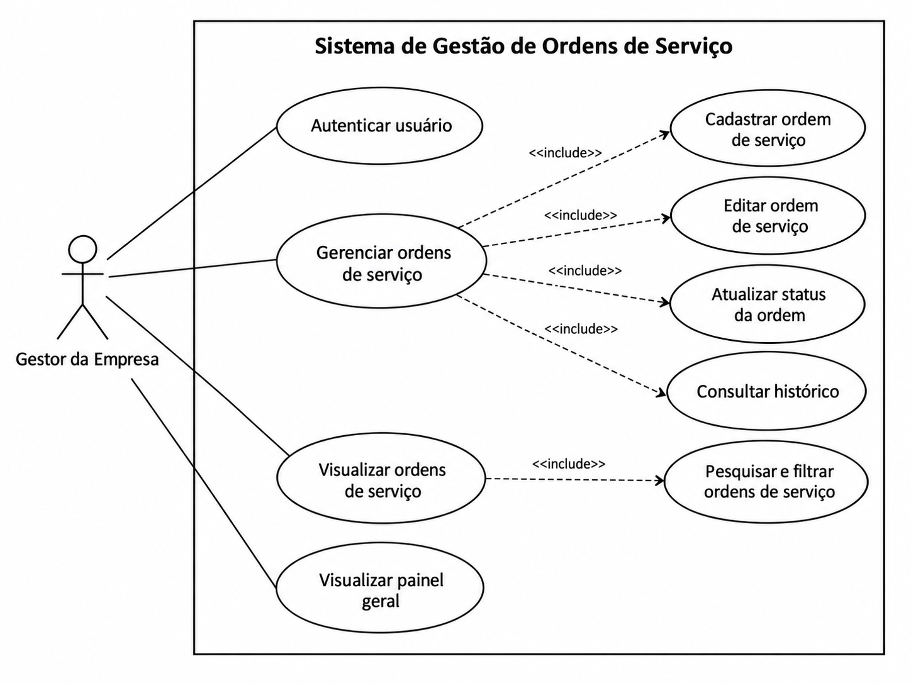
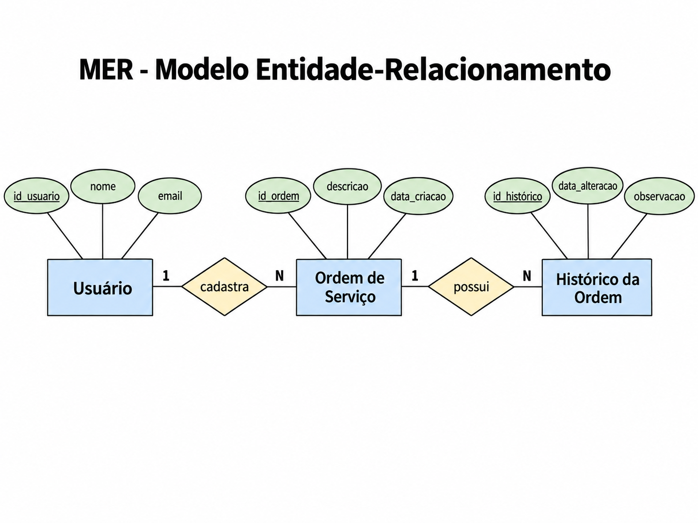
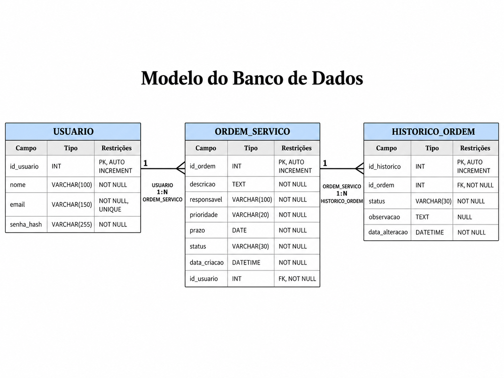

# Especificação do Projeto

O projeto consiste no desenvolvimento de uma aplicação web para gerenciamento de ordens de serviço de uma pequena empresa do ramo têxtil, voltada à fabricação de artigos para idosos e produtos hospitalares.

A especificação da solução foi definida a partir das necessidades dos usuários, considerando os perfis de utilização, histórias de usuário, requisitos funcionais e não funcionais, restrições e casos de uso.

## Perfis de Usuários

<table>
<tbody>

<tr align="center">
<th colspan="2">Gestor da Empresa</th>
</tr>

<tr>
<td width="150px"><b>Descrição</b></td>
<td width="600px">Responsável pelo acompanhamento das atividades de produção e pela organização das ordens de serviço da empresa.</td>
</tr>

<tr>
<td><b>Necessidades</b></td>
<td>Registrar novas demandas, definir responsáveis, prioridades e prazos, acompanhar o andamento das ordens e consultar informações sobre atividades já realizadas.</td>
</tr>

</tbody>
</table>

## Histórias de Usuários

| EU COMO... `QUEM` | QUERO/PRECISO ... `O QUE` | PARA ... `PORQUE` |
|-------------------|-----------------------------|-------------------|
| Gestor da Empresa | Acessar o sistema por meio de autenticação | Utilizar as funcionalidades da aplicação de forma segura |
| Gestor da Empresa | Cadastrar uma ordem de serviço com responsável, prioridade e prazo | Registrar e organizar uma nova demanda |
| Gestor da Empresa | Visualizar, pesquisar e filtrar as ordens de serviço | Acompanhar e localizar as atividades cadastradas |
| Gestor da Empresa | Editar uma ordem de serviço | Corrigir ou atualizar informações da demanda |
| Gestor da Empresa | Atualizar o status de uma ordem de serviço | Registrar em qual etapa a atividade se encontra |
| Gestor da Empresa | Consultar o histórico das ordens | Recuperar informações de atividades já realizadas |
| Gestor da Empresa | Visualizar um painel geral | Acompanhar rapidamente as ordens pendentes, em andamento e concluídas |

## Requisitos do Projeto

As tabelas a seguir apresentam os requisitos funcionais e não funcionais que detalham o escopo do projeto.

### Requisitos Funcionais

| ID | Descrição | Prioridade |
|----|-----------|------------|
| RF-01 | O sistema deve permitir a autenticação do usuário para acesso à aplicação. | Alta |
| RF-02 | O sistema deve permitir o cadastro de ordens de serviço, incluindo descrição, responsável, prioridade e prazo. | Alta |
| RF-03 | O sistema deve permitir a visualização das ordens de serviço cadastradas, com recursos de pesquisa e filtragem. | Alta |
| RF-04 | O sistema deve permitir a edição das informações de uma ordem de serviço. | Alta |
| RF-05 | O sistema deve permitir a atualização do status das ordens de serviço. | Alta |
| RF-06 | O sistema deve permitir a consulta do histórico das ordens de serviço. | Média |
| RF-07 | O sistema deve exibir uma visão geral das ordens pendentes, em andamento e concluídas. | Média |

### Requisitos Não Funcionais

| ID | Descrição | Prioridade |
|----|-----------|------------|
| RNF-01 | O sistema deve possuir interface simples, intuitiva e responsiva. | Alta |
| RNF-02 | O sistema deve apresentar boa legibilidade, contraste adequado e elementos de interface acessíveis. | Alta |
| RNF-03 | O sistema deve proteger senhas e dados dos usuários utilizando boas práticas de segurança de aplicações, considerando referências como OWASP e princípios de segurança da informação alinhados à ISO/IEC 27001. | Alta |
| RNF-04 | O tratamento de dados pessoais deve seguir os requisitos aplicáveis da Lei Geral de Proteção de Dados (LGPD). | Alta |

## Restrições

| ID | Restrição |
|----|-----------|
| RE-01 | O sistema será desenvolvido como uma aplicação web. |
| RE-02 | O projeto deverá ser desenvolvido dentro do prazo acadêmico estabelecido pela disciplina. |
| RE-03 | A solução será limitada ao gerenciamento de ordens de serviço, não contemplando inicialmente funcionalidades de estoque ou vendas. |

## Descrição dos Casos de Uso

A tabela a seguir apresenta os principais casos de uso do sistema e suas respectivas descrições.

| ID | Caso de Uso | Ator | Descrição |
|----|-------------|------|-----------|
| UC-01 | Autenticar usuário | Gestor da Empresa | Permite ao usuário acessar o sistema por meio de suas credenciais. |
| UC-02 | Cadastrar ordem de serviço | Gestor da Empresa | Permite registrar uma nova ordem de serviço, incluindo descrição, responsável, prioridade e prazo. |
| UC-03 | Visualizar ordens de serviço | Gestor da Empresa | Permite consultar, pesquisar e filtrar as ordens de serviço cadastradas. |
| UC-04 | Editar ordem de serviço | Gestor da Empresa | Permite alterar as informações de uma ordem de serviço já cadastrada. |
| UC-05 | Atualizar status da ordem | Gestor da Empresa | Permite registrar a situação atual da ordem conforme o andamento da atividade. |
| UC-06 | Consultar histórico | Gestor da Empresa | Permite visualizar registros anteriores e alterações realizadas nas ordens de serviço. |
| UC-07 | Visualizar painel geral | Gestor da Empresa | Permite acompanhar de forma resumida as ordens pendentes, em andamento e concluídas. |

## Diagrama de Caso de Uso

## Modelo Entidade-Relacionamento

## Modelo do Banco de Dados

## Descrição do Modelo de Dados

O sistema utilizará um banco de dados relacional composto pelas tabelas `USUARIO`, `ORDEM_SERVICO` e `HISTORICO_ORDEM`.

### Tabela USUARIO

| Campo | Tipo | Restrição |
|-------|------|-----------|
| id_usuario | INT | PK, AUTO INCREMENT |
| nome | VARCHAR(100) | NOT NULL |
| email | VARCHAR(150) | NOT NULL, UNIQUE |
| senha_hash | VARCHAR(255) | NOT NULL |

### Tabela ORDEM_SERVICO

| Campo | Tipo | Restrição |
|-------|------|-----------|
| id_ordem | INT | PK, AUTO INCREMENT |
| descricao | TEXT | NOT NULL |
| responsavel | VARCHAR(100) | NOT NULL |
| prioridade | VARCHAR(20) | NOT NULL |
| prazo | DATE | NOT NULL |
| status | VARCHAR(30) | NOT NULL |
| data_criacao | DATETIME | NOT NULL |
| id_usuario | INT | FK, NOT NULL |

### Tabela HISTORICO_ORDEM

| Campo | Tipo | Restrição |
|-------|------|-----------|
| id_historico | INT | PK, AUTO INCREMENT |
| id_ordem | INT | FK, NOT NULL |
| status | VARCHAR(30) | NOT NULL |
| observacao | TEXT | NULL |
| data_alteracao | DATETIME | NOT NULL |
