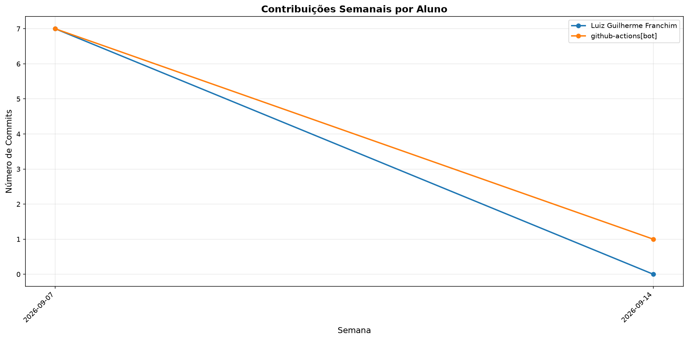

# 📊 Relatório de Contribuições do Projeto

**Última atualização:** 28/09/2026 00:48

---

## 📈 Resumo Geral de Contribuições

| Aluno                   |   Commits |   Linhas+ |   Linhas- |   Arquivos |   Docs Commits |   Docs Arquivos |
|-------------------------|-----------|-----------|-----------|------------|----------------|-----------------|
| Luiz Guilherme Franchim |         7 |      1395 |        49 |         27 |              6 |               3 |
| github-actions[bot]     |         8 |        70 |        24 |          3 |              8 |               1 |

## 📅 Contribuições Semanais (Todo o Semestre)

**2026-09-14**: github-actions[bot]: 1

**2026-09-07**: Luiz Guilherme Franchim: 7, github-actions[bot]: 7

## 📊 Visualização Gráfica

## ℹ️ Observações

- **Commits**: Número total de commits realizados

- **Linhas+**: Linhas de código adicionadas

- **Linhas-**: Linhas de código removidas

- **Arquivos**: Número de arquivos únicos modificados

- **Docs Commits**: Commits em arquivos de documentação

- **Docs Arquivos**: Arquivos de documentação modificados

---

*Relatório gerado automaticamente via GitHub Actions*
